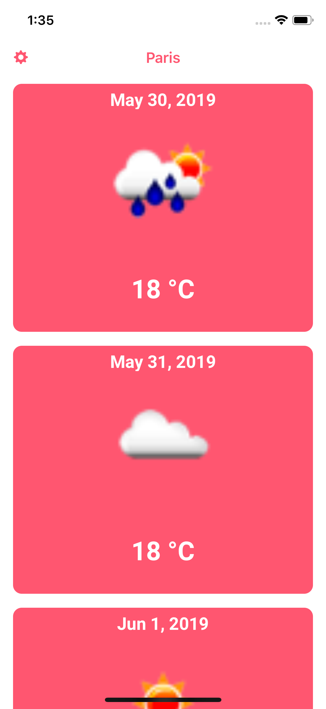

# weather-ios
This application is a simple Android application written in Java that uses the Open Weather API to display the weather forecast for a given city. You can read more about Open Weather Map and their API here: https://openweathermap.org/api

## App Store
This app is not currently available on the Apple App Store. The app was rejected in the Apple review process for lack of valuable content. 

## Configuration
* Sign up for a free developer account at https://openweathermap.org/api
* Download the project from Github.
* Copy your Open Weather Map API key into the ForecastService.swift file, just after "APPID=" in the url path string.
* Run the app.
